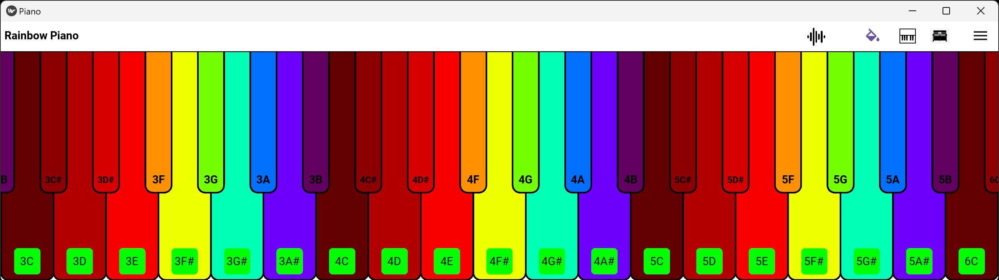
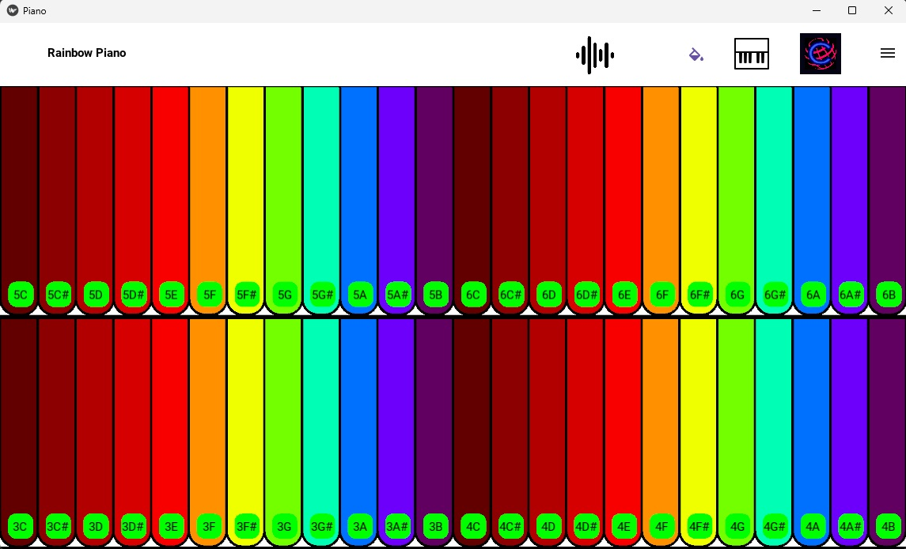
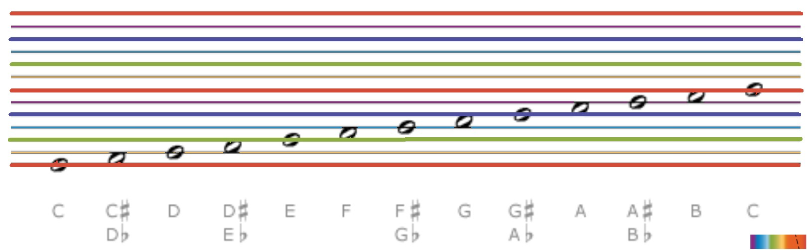

# RainbowPiano 
When piano was first invented in the 1700s, they could only afford two colors - black and white.  
But now we can rainbow-color all the keys, and evenly space them!  

  
  

## Download
Please go into the "android" folder for the .apk file.

## Build Instruction
Ubuntu:  
"instruction_with_ubuntu.txt"  
  
Windows:  
https://www.youtube.com/watch?v=WQ0oNpsTJus  
"instruction_with_googlecolab .ipynb"  

## Links
Rainbow Piano Reddit Community:  
https://www.reddit.com/r/RainbowPiano/  
  
Bharat's Github,Gmail and Upwork Profiles:  
https://github.com/muchhar  
https://upwork.com/freelancers/bharatm2
muchharbharat10@gmail.com

## Further Work
Post on Reddit if you know someone who can turn a RainbowPiano into a digital piano such as the Yamaha Reface CP with fully weighted keys.  
Ever had trouble reading music scores? Maybe we should also rainbow-color them for clarity!  
  
  
## [Donations] (https://github.com/YangPiCui/ProjectIdeas/blob/main/README.md#how-to-donate-in-descending-preference-for-me)
