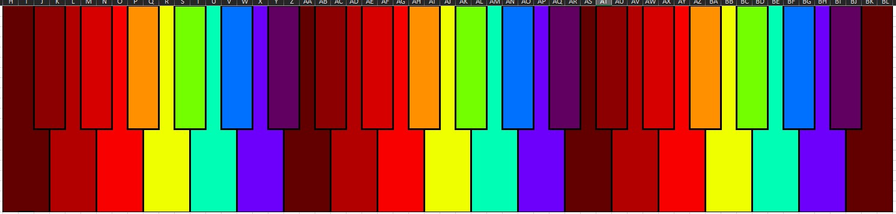
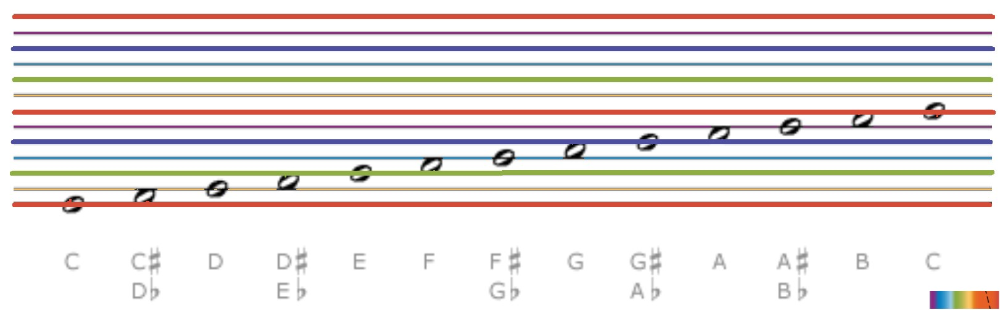

# RainbowPiano 

## Description
When piano was first invented, they could only afford the colors black and white...  
But now we can afford to rainbow-color all the keys!  
And space the keys evenly without confusion!  

  
  

## Instruction

## Further Work
Post on Reddit if you know someone who can turn a RainbowPiano into a digital piano such as the Yamaha Reface CP with fully weighted keys.  
Ever had trouble reading music scores? Maybe we should also rainbow-color them for clarity!  
  

## External Links
Rainbow Piano Reddit Community:  
https://www.reddit.com/r/RainbowPiano/  
  
Bharat's Github and Upwork Profiles:  
https://github.com/muchhar  
https://upwork.com/freelancers/bharatm2  
  
## Donations (In Descending Preference)
1. Repent​, be baptize​d in Jesus Christ's name, and become as a little child. [Matthew 18:2-5 | 3 Nephi 11:38 | Mosiah 3:19]  

2. Donate to a charity you like  

3. Donate with the only real true restored Bitcoin  
Bitcoin Satoshi Vision (BSV) Address: 1QCedBfwVH12BTPrCqE8yB3mq3Jt55iJXH  
  
4. Paypal (please note "RainbowPiano" in your donation):  
https://paypal.me/PrivateCommisioner
